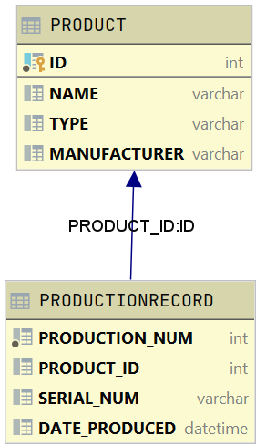

# Production Project
The Production Project program is for a media player production facility to keep tracking of products being produced.  With this program, employees of the production facility can input new products and store them in a collection that can be recalled by any other employees at any time.  In addition, employees can now create production reports with ease.  I created this project on my own with the help of my Object-Oriented Programming professor and teaching assistants.  The Production Project program was created as a semester long program for my Object-Oriented Programming course during my senior year at Florida Gulf Coast University.  Previously, I had worked with Java and C++ in two other programming classes.  My proficiency with Java was mediocre, as I had not worked heavily with objects in Java or C++.  Not only did this project reinforce topics covered in my OOP course, the concept of creating production records and storing them in an accessible database is relevant to my information systems and supply chain management education from the Lutgert College of Business at FGCU.

## Demonstration

## Documentation

## Diagrams
Class Diagram:   

 
 Database Diagram:  
 

## Getting Started

## Built With
* IntelliJ 
* Repl.it
* Oracle Academy Java Programming Textbook & Resources 

## Contributing

## Author
* Macie R. Ryan

## License

## Acknowledgments
* Oracle Academy
* W3 Schools
* Professor Scott Vanselow
* Andrew Cavallaro

## History

## Key Programming Concepts Utilized
* Databases
    * This program includes a database powered by H2.
* Polymorphism
    * The ability of an object, variable, or function to take on multiple forms.
* Encapsulation
    * Used to hide data or methods associated with an instantiated class or object.
* Recursion
    * The process in which a function calls itself directly or indirectly.